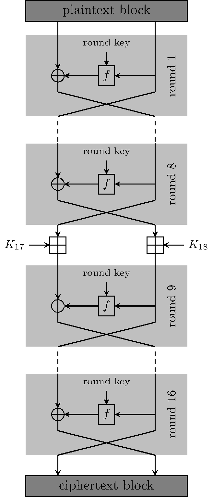
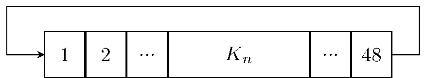

[](https://travis-ci.com/tassadarius/LAMBDA1)

# LAMBDA1 Encryption Algorithm

LAMBDA1 is a block cipher developed in mid to late 1980s in Eastern Germany (German Democratic Republic - GDR).
The algorithm is a modified DES (Data Encryption Standard) and therefore shares many properties with it.


|  Property     |  Value/Status    |
| ------------- |-----------|
| Block size    | 64 bit           |
| Key size      | 256 bit          |
| Structure     | Feistel cipher   |
| Cryptanalysis | unknown          |

The algorithm differs slightly from DES - mainly the key and key derication function. You find more information how the algorithm works below.

## Build with developer command line / Mono under Linux

```bash
msbuild LAMBDA1.sln -restore
```

## Build with Visual Studio

`Open the solution`

then hit

`Build` &#8594; `Build Solution (Ctrl+Shift+B)`

# About this software

This is a scientific implementation of the specified algorithm in C#. It was developed as part of a bachelor's thesis. The implementation is correct according
to the original documents and test cases provided by the BStU (archive for documents of the "Stasi" - document no. MfS-Abt-XI-601).

This repository contains the algorithm ([LAMBDA1](../src/LAMBDA1)) and a basic terminal program ([LAMBDA1Tool](../src/LAMBDA1Tool)). The tool allows the creation of keys and encryption/decryption in Cipher Feedback Mode.
This mode was chosen for historic reasons, as it was intended to be used in Eastern Germany as well.

Note that this implementation works correctly but does not utilize any tricks to speed it up. In fact it is very slow. The algorithm is also part of [CrypTool 2](https://cryptool.org/de/cryptool2) check it out.

This software is licensed under the [GPL-3.0](https://www.gnu.org/licenses/gpl-3.0-standalone.html).

## Usage Examples

The program `LAMBDA1Tool` can be used to create keys and encrypt/decrypt messages:

```bash
LAMBDA1Tool --create-key keyfile                        // Creates a key
LAMBDA1Tool -k keyfile -e input.txt ciphertext.bin      // Encrypts input.txt and outputs to ciphertext.bin
LAMBDA1Tool -k keyfile -d ciphertext.bin                // Decrypts the file again and prints to stdout
```

It supports input/output files as well as reading/writing to stdout/stdin.

Use `LAMBDA1Tool --help` for more information

# About the Algorithm

LAMBDA1 uses the same Feistel structure as DES. It consists of 16 rounds with a left and right block.
There are 3 differences in the scheme compared to DES. These are the following:
    
 * The input permutation was removed
 * The output permutation was removed
 * In the 8th round, an additional operation is added. Both blocks are modulo added with additional keys ($K_{17}$ and $K_{18}$). The operation is denoted with the symbol $\boxplus$ - the divisor is $2^{32}$ (0x100000000)

Following diagram shows the scheme. $f$ is the round function (described below). The symbol $\oplus$ is a bitwise XOR:

<p align="center">
    </br></br>
    Scheme of LAMBDA1
</p>

### Decrypting
As in DES reverse the order of the round keys for decryption, as well as swap the keys 17 and 18.

# Round function 

In LAMBDA1 all functions, permutations and S-Boxes are the same as in DES. However, their arrangement differs slightly.
In a normal round of DES the permutation $P$ is applied in the beginning before the expansion function. In LAMBDA1 it has been
moved to the end after the S-Boxes.

A single round is depicted here. $K_n$ is the 48 bit round key:

<p align="center">
    </br></br>
    Scheme of the round function 𝒇
</p>


# Key derivation

The key derivation is the main difference between LAMBDA1 and DES. As the developers knew that the key length of DES was its greatest weakness, the key length was drastically increased
from 56 to **256 bits**. As a trade-off the key derivation function is way simpler. Note that LAMBDA1 has to derive 18 instead of the usual 16 subkeys, as two 32 bit keys are required for
the modulo addition in round 8.

The first round keys ($K_1$ to $K_4$) and the additional keys ($K_{17}$ and $K_{18}$) are directly taken from the key.

$$
\begin{alignat*}{2}
&K_{1}&&:= (S_{1}, S_{2},...,S_{48})\\
&K_{2}&&:= (S_{49}, S_{50},...,S_{96})\\
&K_{3}&&:= (S_{97}, S_{98},...,S_{144})\\
&K_{4}&&:= (S_{145}, S_{146},...,S_{192})\\
&K_{17}&&:= (S_{193}, S_{194},...,S_{224})\\
&K_{18}&&:= (S_{225}, S_{226},...,S_{256})\\
\end{alignat*}
$$

 The rest of the keys are generated in a very simple LFSR (Linear-feedback shift register) by shifting the bits 11 times.
 Following image shows the Shifting Register function. It is very simple and only appends the last bit at the front again.

<p align="center">
    </br>
    Shifting register 𝑇
</p>

The rest of the key derivation can mathematically be expressed as this:

$$
\begin{alignat*}{2}
&\forall n \in \overline{5,12}: \quad&&K_{n} := \textrm{T}^{11}(K_{n-4})\\
&\forall n \in \overline{13,16}: \quad&&K_{n} := \textrm{T}^{11}(K_{25-n})\\
\end{alignat*}
$$

Where $n$ denotes the round, $K_n$ the key for that round and $T$ the shifting function.
$T^b$ specifies the input shall be shifted $b$ times, which is in our case always 11. 

#### For people not so familiar with mathematical representation, the keys are generated the following way:
 - **round 1 to 4** are the first 192 bits of the main key
 - **round 5 to 8** by shifting the keys 1 to 4 in the shifting function (shift is always 11 bits in the key derivation)
 - **round 9 to 12** by shifting the keys 5 to 8
 - **round 13 to 16** by shifting the previous key. That means that for round 13 the key 12 is shifted. For round 14 the key from 13 and so on
 - **bonus keys 17 and 18** are the bits 192 to 256 (only 32 bits per key)

# Additional information

Some more details and examples about some operations used above 

### Modulo addition (Symbol $\bm{\boxplus}$)

This is a basic addition which is then taken modulo. This is equivalent when you add hours to a day, which is a modulo addition by 24:
```
20 +  8 = 28 % 24 = 4
16 + 16 = 32 % 24 = 8
23 +  1 = 24 % 24 = 0
10 +  5 = 13 % 24 = 15
```

In the algorithm the divisor is $2^{32}$ (0x100000000). That means:

`half_block` $\boxplus$ `key` % `0x100000000`

for example:

```
3181677172 + 2434904559 = 5616581731 % 0x100000000 = 1321614435
```


### Examples for Shifting function $\bm{T}$ on 48 bit keys

`111111111111111111111111000000000000000000000000` &#8594; $T^{11}$ &#8594; `000000000001111111111111111111111110000000000000`

`000000000000000000000000111111111111111111111111` &#8594; $T^{11}$ &#8594; `111111111110000000000000000000000001111111111111`

`000000000000000000000000000000000000011111111111` &#8594; $T^{11}$ &#8594; `111111111100000000000000000000000000000000000000`

`000011110000111100001111000011110000111100001111` &#8594; $T^{11}$ &#8594; `111000011110000111100001111000011110000111100001`
